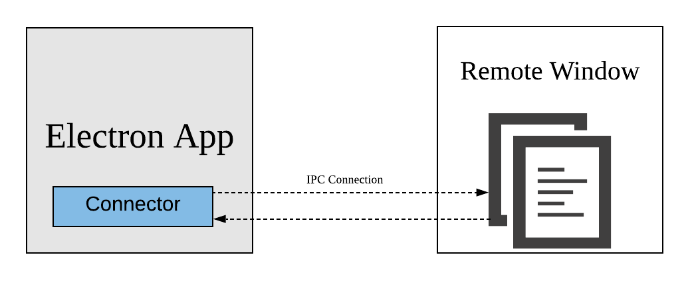

# Electron Connector

A nodejs tool for injecting custom logic into 3rd-party electron application.



## Install
```bash
$ yarn add electron-connector
```

## Custom Inject

Inject your custom codebase

```js
const path = require('path');
const { AsarInjector } = require('electron-connector');

// (required) the target asar
const archive = 'C:/Users/xxxx/AppData/Local/Microsoft/Teams/current/resources/app.asar';
// (required) your codebase (file or folder) for injecting
const injectionSrc = path.resolve(__dirname, './injection');
// (optional) your temp folder for building
const buildDir = path.resolve(__dirname, '../build');

const injector = new AsarInjector({
  archive,
  buildDir,
});

injector
  .inject(injectionSrc)
  .then((res) => {
    console.log(res);
  }).catch((err) => {
    console.error(err);
  });
```

## Inject Connector

Inject connector that is provided by default. So that we can
- Send actions to target electron application remotely
- Receive events from target electron application

```js
const { AsarInjector, Connector } = require('electron-connector');
const path = require('path');
const brand = require('./brand');

// (required) the target asar
const archive = 'C:/Users/xxxx/AppData/Local/Microsoft/Teams/current/resources/app.asar';
// const archive = '/Applications/Microsoft Teams.app/Contents/Resources/app.asar';
// (optional) your temp folder for building
const buildDir = path.resolve(__dirname, '../build');

const injector = new AsarInjector({
  archive,
  buildDir,
});

const connector = new Connector({
  applicationId: brand.brandAppId,
  localNetworkPort: brand.networkPort,
  remoteNetworkPort: brand.networkPort + 1,
});

injector
  .injectConnector(connector)
  .then((res) => {
    console.log(res);
  }).catch((err) => {
    console.error(err);
  });
```

## RemoteWindow of Connector

RemoteWindow is a remote controller for target electron BrowserWindow
- Regular functions like show/hide/close/inspect are supported
- Extends to RemoteWindow and more functions as needed
- Electron events transition supported

```js
const { RemoteSdk } = require('electron-connector');
const brand = require('./brand');

const sdk = new RemoteSdk({
  localNetworkPort: brand.networkPort + 1,
  remoteNetworkPort: brand.networkPort,
});

sdk.getWindows()
  .then((wins) => {
    wins[0].webContents.inspect();
    wins[0].webContents.executeScript('alert("hello everyone!")');
  })
  .catch((err) => {
    console.error(err);
  });

// Receive Electron Events
sdk.ipcServer.on('heartbeat', ({
  resolve,
  payload,
}) => {
  console.log('heartbeat', payload);
  resolve();
});

sdk.ipcServer.start();
```
